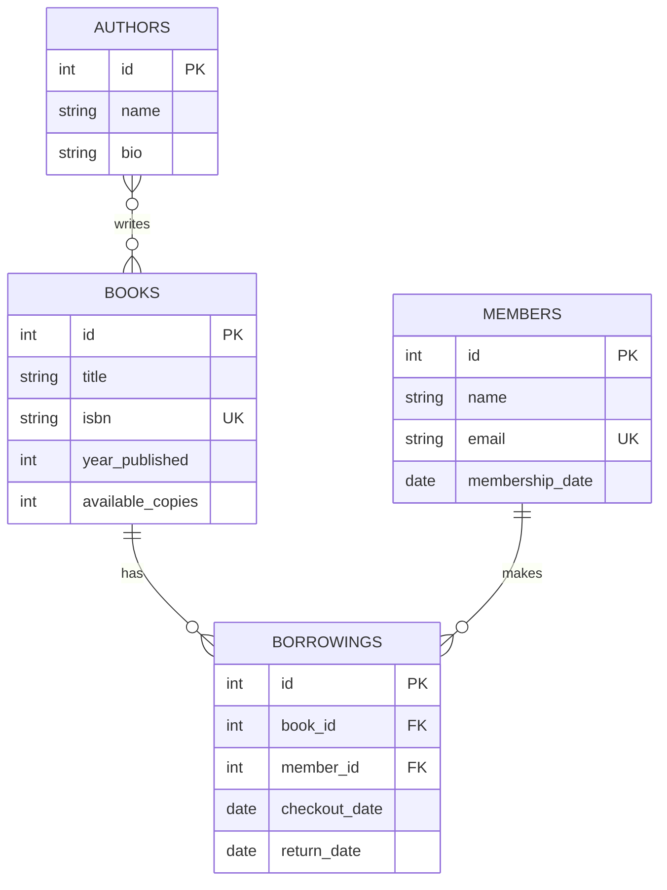

# Library Management System

A command-line library management application built with Python, SQLite, and SQLAlchemy 2.0. The program stores books, authors, members, and borrowing history, and supports common library operations such as adding books and members, searching, checking books out, returning books, and viewing overdue items.

## Database Design

The project uses four main models plus one association table:

- `books` stores title, ISBN, publication year, and available copies.
- `authors` stores author names and optional biographies.
- `members` stores member names, unique emails, and membership dates.
- `borrowings` connects a member to a book and stores checkout and return dates.
- `book_authors` connects books and authors for the many-to-many relationship.

## ERD

A book can have multiple authors and an author can have multiple books, so `book_authors` is used as a many-to-many association table. A book and a member can both have many borrowing records, while each borrowing belongs to one book and one member.

## Project Files

- `models.py` — SQLAlchemy models, relationships, and database setup
- `crud.py` — create, read, update, and delete functions
- `main.py` — command-line menu and user interaction
- `seed.py` — loads the sample data
- `sample_data.json` — sample authors, books, members, and borrowings
- `requirements.txt` — project dependency

## Setup

1. Create and activate a virtual environment.
2. Install the dependency:

   `pip install -r requirements.txt`

3. Seed the database:

   `python seed.py`

   Note: running `seed.py` resets the database before loading the sample data.

4. Start the application:

   `python main.py`

## CLI Menu

The application provides these options:

1. Add a book
2. Add a member
3. Search books
4. Check out a book
5. Return a book
6. View a member's active borrowings
7. View overdue books
8. Exit

## Data Integrity and Error Handling

The project protects the database from several common problems:

- ISBN values are unique.
- Member email addresses are unique.
- A book cannot be checked out when `available_copies` is 0.
- Checking out a book decreases its available copies by 1.
- Returning a book sets its return date and increases available copies by 1.
- A book cannot be deleted while it has an active borrowing.
- A member cannot be deleted while they have an active borrowing.
- Invalid IDs and invalid CLI input are handled with readable error messages.

## CRUD Functions

Create:
- `add_book()`
- `add_author()`
- `add_member()`
- `checkout_book()`

Read:
- `list_books()`
- `search_books_by_title()`
- `find_books_by_author()`
- `list_member_borrowings()`
- `list_overdue_books()`

Update:
- `return_book()`
- `update_member_email()`

Delete:
- `delete_book()`
- `delete_member()`

## Testing

The project was tested using the provided seed data and by checking the main library workflow:

- Seed 5 books, 3 authors, 4 members, and 6 borrowing records.
- Search for books by title and by author.
- Check out an available book and verify the available copy count decreases.
- View a member's current borrowings.
- Return the book and verify the available copy count increases.
- Verify overdue books are detected using the checkout date.
- Verify unavailable books cannot be checked out.
- Verify books and members with active borrowings cannot be deleted.
- Verify duplicate ISBNs and member emails are rejected.

## Design Decision

I used a separate `Borrowing` model instead of a simple many-to-many association table between books and members. A borrowing needs its own data, especially `checkout_date` and `return_date`, so treating it as a model makes it easier to track borrowing history, current checkouts, and overdue books.
